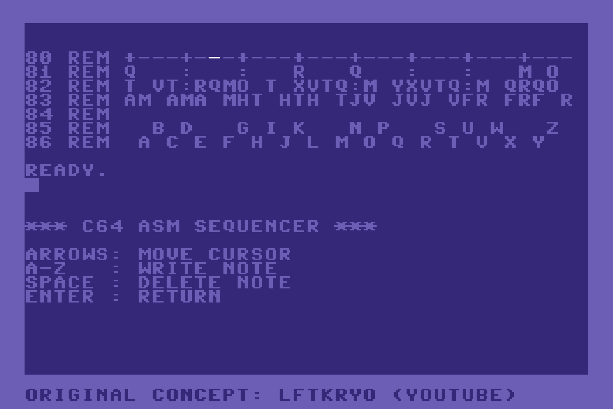

# C64 Assembly Sequencer Port (lftkryo)

* **Original Author:** [Linus Åkesson (lftkryo)](https://linusakesson.net/)
* **Original Video:** [Making 8-bit Music From Scratch at the Commodore 64 BASIC Prompt](https://www.youtube.com/watch?v=ly5BhGOt2vE)

A JavaScript port of the legendary 249-byte Commodore 64 musical sequencer originally written in 6502 Assembly and BASIC.

<https://tomcoolpxl.github.io/c64-synth/>



## AI & Development

This mini-project served as a focused test of the **Gemini Pro CLI** to see if an AI agent could successfully translate hardware-level logic from 1980s BASIC and 6502 Assembly into a  functional JavaScript application.

The AI managed to decipher the frequency table generation, the screen memory scanning logic, and the "Snare Hack" synthesis trick. A fully working prototype, including the interactive sequencer, was delivered within **45 minutes** with only gentle coaching to refine the hardware timings.

Subsequent AI time was spent building the authentic C64 "mini-simulator" interface (the virtual grid, cursor, and interactive BASIC shell) and refactoring the generated code into a modular codebase.

## Origin & Concept

This project replicates a specific, highly optimized workflow where the C64's built-in BASIC environment acts as the sequencer's User Interface. Instead of building a complex GUI, the assembly program reads note data directly from the characters typed onto the screen.

### The Original BASIC Loader
The entire sequencer is generated by this BASIC program. It reads machine code from DATA statements, writes it to memory, generates the frequency table, and sets up the screen:

```basic
10 READ V: IF V>=0 THEN POKE A,V: A=A+1: GOTO 10
20 IF V<-1 THEN A=-V*256: GOTO 10
30 F=40: FOR I=0 TO 116
40 POKE 194*256+I, F AND 255
50 POKE 195*256+I, F/256
60 F=F*1.0595: NEXT
80 REM +---+---+---+---+---+---+---+---
81 REM Q   :   :   R   Q   :   :   M O
82 REM T VT:RQMO T XVTQ:M YXVTQ:M QRQO
83 REM AM AMA MHT HTH TJV JVJ VFR FRF R
84 REM
85 REM   B D   G I K   N P   S U W   Z
86 REM  A C E F H J L M O Q R T V X Y
90 SYS 192*256
98 PRINT CHR$(147)
99 LIST 80-89
100 DATA -212
110 DATA 0,0,0,0,0,0,239
... (see video)
```

## The "Clever" Assembly Tricks

This port emulates the specific hardware-level logic used in that 249-byte program:

### 1. Screen RAM as Sequencer Data
The C64 stores its screen characters at memory address `$0400` (1024). The assembly code reads offsets `+127`, `+167`, and `+207`. In 40-column mode, these correspond exactly to three specific lines of text on the screen. By typing letters (A-Z) on these lines, the user is "writing" to the sequencer's pattern memory in real-time.

### 2. The Bass & Snare Hybrid (Voice 3)
One of the most brilliant hacks in the original code is how it handles the baseline and percussion on a single SID voice:
*   **Bass Tone:** When the sequencer reads a letter (Note On), it plays a low **Sawtooth** wave.
*   **The Snare Trick:** When it reads a Space character (Note Off), instead of just silencing the voice, it switches the waveform to **Noise** and turns the Gate bit off. The "Release" phase of the envelope then plays a fading burst of white noise, creating a synthesized **Snare Drum** effect automatically.

### 3. Timing via the Jiffy Clock
The sequencer doesn't use a dedicated timer. It reads the C64 system interrupt clock (the "Jiffy Clock" at `$A2`), bit-shifts it right by 3 places (`LSR`) to create a divide-by-8 tempo, and uses that to step through the 32 notes of the pattern.

## Port Features

*   **Interactive Shell:** Boots directly into a "READY." prompt.
*   **True-to-Life Logic:** Implements the exact pitch-masking math from the original ASM (`ADC` values 82, 70, 46).
*   **High-Res Pixel Font:** Uses the "Sixtyfour" variable font, rendered at 64px and downscaled to 0.25 to ensure the "square" pixel structure is perfectly preserved without browser blurring.
*   **PAL Accuracy:** Tuned to the 985,248Hz PAL clock for the authentic 6581 SID sound.

## Controls

*   **Intro:** Type `RUN` (provided) and press **ENTER**.
*   **Sequencer:**
    *   **Arrow Keys:** Navigate the screen.
    *   **A-Z:** Write notes (Letters determine pitch via the ASM mask).
    *   **Space:** Delete note (Triggers Snare on Voice 3).
    *   **Click:** Return to the BASIC prompt.
